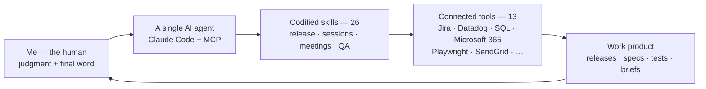

# AI Ops Case Studies

  

> How one Product Owner runs like a team — the manual analyst processes I've codified into AI-driven tools, the environment they run in, and the artifacts they produce.

I'm a Product Owner / technical business analyst. Across 10+ years in government and payments software, I've come to see most slow, manual work as **un-codified process** — so I codify it into tools that lift my throughput, accuracy, and consistency, while keeping a human on the judgment calls. This repo collects that practice in three layers: the deep-dive **case studies**, the **operating environment** they run in, and the interactive **showcase** artifacts they produce.

> **Start here → [The AI Operating Environment](docs/ai-operating-environment.md).** The whole system on one page: the tools I drive and the workflows I've codified on top of them. **13 connected tools · 26 codified skills · one agent, with me on every judgment call.**

## Case studies — the process, the build, what changed

| Case study | The gist | Outcome |
|---|---|---|
| [Release Pipeline](case-studies/01-release-pipeline.md) | A one-command pipeline that assembles a software release — gathers its JIRA tickets, verifies each was actually fixed, drafts the notes, and routes a stakeholder document for human review. | Release prep **~12 hours → ~90 minutes** (~8×) |
| [AI-Driven QA & Troubleshooting](case-studies/02-qa-and-troubleshooting.md) | A multi-agent harness that runs plain-English test scenarios against a real browser, plus a repeatable loop for finding the *root cause* of a bug. | Repeatable pre-release verification + faster, evidence-backed bug investigation |

## The operating environment — what I drive, and what I've built on it

The two case studies are the highlights; they sit on top of a broader stack. [**The AI Operating Environment**](docs/ai-operating-environment.md) is the full picture — the tools I drive through a single AI agent, and the library of workflows I've codified on top of them (release operations, session intelligence, meeting summarization, and a QA harness). It's the answer to *"how does one person run like a team?"*

## Interactive showcase — the artifacts, runnable

[**The showcase**](showcase/) collects self-contained, browser-runnable proofs and mockups — a benefit-tax calculation engine you can edit and re-run, a payment-reassurance dashboard, requirement-to-screen redesigns, and legacy-migration instrumentation. Where the case studies explain a process, these let you *see and click* the output.

---

Everything here is built with [Claude Code](https://claude.com/claude-code) (skills + the Model Context Protocol) as a **human-in-the-loop** system: the model proposes, I review and correct, and the corrections feed back into the prompts.

*These are sanitized patterns — public tools are named (JIRA, Microsoft Teams, Playwright, Claude Code); employer-specific data is withheld and all examples are synthetic ([details](docs/about.md)).*

**More:** [about & philosophy](docs/about.md) · [the operating environment](docs/ai-operating-environment.md) · [showcase](showcase/) · [LinkedIn](https://www.linkedin.com/in/nathanielgenwright/)

— Nathaniel Genwright
