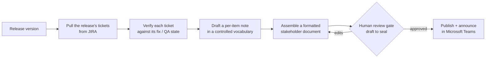

# Case Study: One-Command Release Pipeline

> ~12 hours of manual release prep → ~90 minutes — with better consistency and a human still in control of the final word.

## The problem

Shipping a software release meant assembling a release-notes package by hand. For each release I had to:

1. Gather every ticket included in the release from JIRA.
2. Verify each ticket was *actually* fixed — not just marked "done."
3. Write a plain-English note for every feature, bug, and change.
4. Assemble those into a formatted, stakeholder-ready document.
5. Distribute it and announce the release.

Done carefully, this took the better part of two working days (~12 hours). It was also **inconsistent** — the same kind of change might be described three different ways across three releases — and it was easy to miss a ticket or describe a fix that hadn't truly landed.

## What I built

A single-command pipeline (a [Claude Code](https://claude.com/claude-code) skill) that runs the whole assembly and hands me a draft to edit:

Key design choices:

- **Controlled vocabulary.** Notes are drafted against a fixed taxonomy of change types and product areas, so descriptions read consistently release-to-release instead of ad-hoc.
- **Verification, not just collection.** The pipeline checks each ticket against its fix/QA state and flags anything unverified, so a "done" ticket that wasn't really fixed doesn't slip into the notes.
- **A two-stage human gate.** The pipeline produces a *draft*; nothing goes out until I edit it and explicitly approve. The automation does the assembly — a human owns the final word.
- **Deterministic ops + generated narrative.** The mechanical parts (gathering, formatting, indexing, distributing) are deterministic and repeatable; only the prose drafting uses the model.

## The outcome

- **~12 hours → ~90 minutes** per release (~8×) — most of the remaining time is my review and edits.
- **More consistent** notes, thanks to the controlled vocabulary.
- **Fewer escapes** — unverified tickets get flagged before they reach a stakeholder document.

## What I'd carry to any team

- Automate the *assembly*, not the *judgment*. The human gate is the feature, not a limitation.
- A controlled vocabulary is a small investment that pays off every single release.
- "Verify, don't just collect" is the difference between a release-notes tool and a release-notes liability.

*Sanitization note: built on real, public tools — JIRA, Microsoft Teams, Claude Code. Employer-specific data (real ticket contents, customers, the internal document store) is withheld; all examples are synthetic.*
