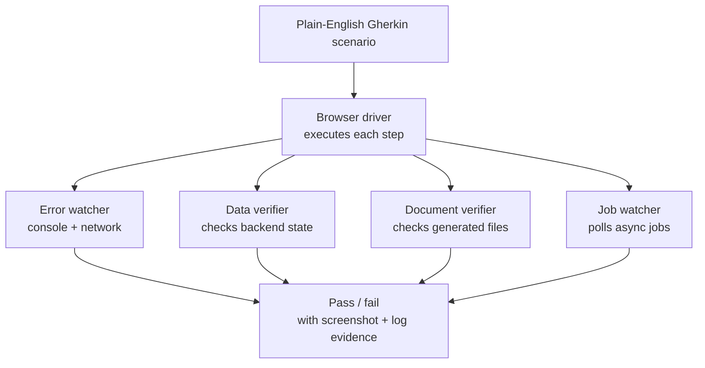
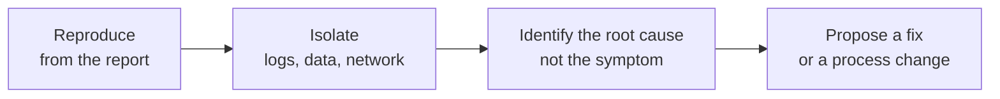

# Case Study: AI-Driven QA & Root-Cause Troubleshooting

> A multi-agent harness that runs plain-English test scenarios against a real browser — and a repeatable way to find the *actual* cause of a bug.

## The problem

Two recurring, manual jobs:

1. **Verifying changes before release.** Clicking through the same flows by hand, every release, hoping to catch regressions. Slow, tedious, and the first thing to get skipped under deadline pressure.
2. **Investigating a reported bug.** A client reports something is broken. Reproducing it, isolating where it goes wrong, and finding the *root* cause (versus a symptom) was ad-hoc and time-consuming.

## What I built

### 1. A test-execution harness

A [Claude Code](https://claude.com/claude-code) skill that reads test scenarios written in **plain-English Gherkin** (`Given / When / Then`) and drives a **real browser** to execute them — then fans out to parallel sub-agents that each watch a different signal:

The point: a UI test that only checks the screen is half a test. A form that shows "Saved" but never writes to the database will pass a click-through and still fail the user — the data verifier catches exactly that. By checking backend state, generated documents, and asynchronous jobs **in parallel**, the harness finds failures the screen alone would miss — and it produces *evidence*, not just a green checkmark.

### 2. A root-cause troubleshooting loop

When a client reports a bug, the hard part is rarely the fix — it's separating the *symptom* from the *cause*. I work a repeatable loop instead of a guess-and-check scramble:

The same integrations that power the test harness — logs, database state, network traffic — let me reproduce a reported issue, isolate which layer it actually breaks in, and confirm the root cause before proposing a fix. The fix then targets the disease, not the symptom.

## The outcome

- **Repeatable pre-release verification** that a non-engineer can run and read.
- **Faster, evidence-backed bug investigation** — reproduce, isolate, and point at the actual cause instead of patching symptoms.
- Tests written in plain English, so the *intent* of a test is legible to anyone — not just whoever wrote it.

## What I'd carry to any team

- A UI test that doesn't check the data layer is lying to you half the time. Verify state, not just the screen.
- Plain-English scenarios make tests a shared asset instead of a specialist's private knowledge.
- Troubleshooting is a *process* — reproduce, isolate, root-cause — and writing it down makes it teachable.

*Sanitization note: built on Playwright / browser dev-tools and Claude Code. The application under test and its data are employer-specific and withheld; all examples are synthetic.*
